# Домашнее задание к занятию 1 «Disaster recovery и Keepalived». Потапчук Сергей.

### Цель задания
В результате выполнения этого задания вы научитесь:
1. Настраивать отслеживание интерфейса для протокола HSRP;
2. Настраивать сервис Keepalived для использования плавающего IP

------

### Чеклист готовности к домашнему заданию

1. Установлена программа Cisco Packet Tracer
2. Установлена операционная система Ubuntu на виртуальную машину и имеется доступ к терминалу
3. Сделан клон этой виртуальной машины, они находятся в одной подсети и имеют разные IP адреса
4. Просмотрены конфигурационные файлы, рассматриваемые на лекции, которые находятся по [ссылке](1/)

------

### Инструкция по выполнению домашнего задания

1. Сделайте fork [репозитория c шаблоном решения](https://github.com/netology-code/sys-pattern-homework) к себе в Github и переименуйте его по названию или номеру занятия, например, https://github.com/имя-вашего-репозитория/gitlab-hw или https://github.com/имя-вашего-репозитория/8-03-hw).
2. Выполните клонирование этого репозитория к себе на ПК с помощью команды git clone.
3. Выполните домашнее задание и заполните у себя локально этот файл README.md:
   - впишите вверху название занятия и ваши фамилию и имя;
   - в каждом задании добавьте решение в требуемом виде: текст/код/скриншоты/ссылка;
   - для корректного добавления скриншотов воспользуйтесь инструкцией [«Как вставить скриншот в шаблон с решением»](https://github.com/netology-code/sys-pattern-homework/blob/main/screen-instruction.md);
   - при оформлении используйте возможности языка разметки md. Коротко об этом можно посмотреть в [инструкции по MarkDown](https://github.com/netology-code/sys-pattern-homework/blob/main/md-instruction.md).
4. После завершения работы над домашним заданием сделайте коммит (git commit -m "comment") и отправьте его на Github (git push origin).
5. Для проверки домашнего задания преподавателем в личном кабинете прикрепите и отправьте ссылку на решение в виде md-файла в вашем Github.
6. Любые вопросы задавайте в чате учебной группы и/или в разделе «Вопросы по заданию» в личном кабинете.

------

### Задание 1
- Дана [схема](1/hsrp_advanced.pkt) для Cisco Packet Tracer, рассматриваемая в лекции.
- На данной схеме уже настроено отслеживание интерфейсов маршрутизаторов Gi0/1 (для нулевой группы)
- Необходимо аналогично настроить отслеживание состояния интерфейсов Gi0/0 (для первой группы).
- Для проверки корректности настройки, разорвите один из кабелей между одним из маршрутизаторов и Switch0 и запустите ping между PC0 и Server0.
- На проверку отправьте получившуюся схему в формате pkt и скриншот, где виден процесс настройки маршрутизатора.

### Решение

[Схема](task-1/hsrp_advanced_new.pkt)

1. На Router1 Необходимо повысить приоритет на интерфейсе Gi0/1 до 95, иначе при разраве связи на Router2 интерфейса Gi0/0 приоритет интерфейса Gi0/1 этого же роутера станет равным 90, что всё равно выше приоритета интерфейса Gi0/1 роутера Router1 - 50.
```
en
conf t
int g0/1
standby 1 priority 95
standby 1 preempt
standby 1 track g0/0
exit
exit
exit
```

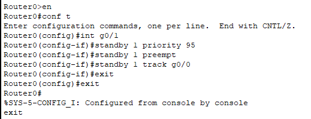

2. На Router2
```
en
conf t
int g0/1
standby 1 track g0/0
exit
exit
exit
```

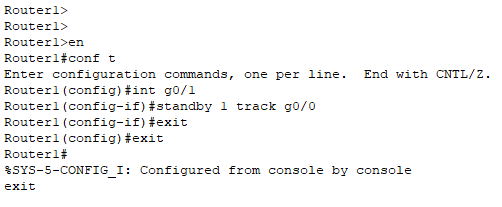

------

### Задание 2
- Запустите две виртуальные машины Linux, установите и настройте сервис Keepalived как в лекции, используя пример конфигурационного [файла](1/keepalived-simple.conf).
- Настройте любой веб-сервер (например, nginx или simple python server) на двух виртуальных машинах
- Напишите Bash-скрипт, который будет проверять доступность порта данного веб-сервера и существование файла index.html в root-директории данного веб-сервера.
- Настройте Keepalived так, чтобы он запускал данный скрипт каждые 3 секунды и переносил виртуальный IP на другой сервер, если bash-скрипт завершался с кодом, отличным от нуля (то есть порт веб-сервера был недоступен или отсутствовал index.html). Используйте для этого секцию vrrp_script
- На проверку отправьте получившейся bash-скрипт и конфигурационный файл keepalived, а также скриншот с демонстрацией переезда плавающего ip на другой сервер в случае недоступности порта или файла index.html

### Решение

Создал две ВМ, установил на них Keepalived и Nginx. Есть два способа перемещать плавающий адрес на другую ноду: перевести текущую ноду в состояние FAULT командой fail или понизить приоритет командой weight.

**Важно! Если у ноды приоритет 255, то он не понижается, это "священный" уровень, говорящий: "Я всегда мастер, даже если всё сломано".**

Создал два файла для первой ноды:


Файл скрипта [/etc/keepalived/check_http.sh](task-2/check_http.sh) (не забыть дать права на исполнение)

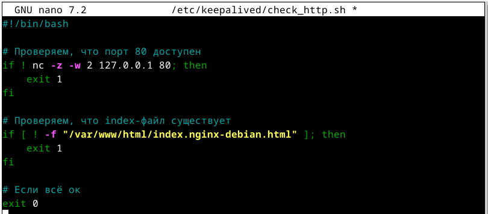

Файл конфигурации Keepalived [/etc/keepalived/keepalived.conf](task-2/keepalived.conf) (не забыть сделать reload Keepalived сервиса)

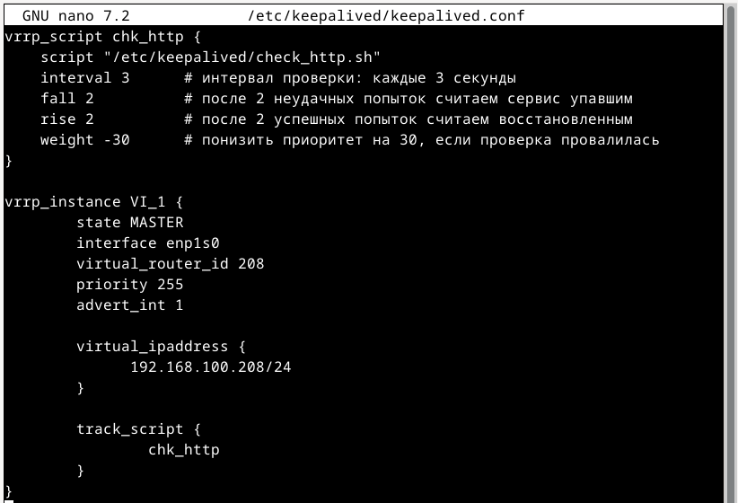

Для второй ноды файл конфигурации анологичный и файл скрипта тот же, можно понижать приоритет, в надежде, что будет еще одна нода, которая подхватит, если упадет эта.

Перемещаем файл index.nginx-debian.html в домашнюю директорию, плавающий адрес исчезает

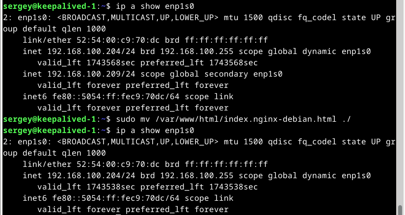

и появляется на keepalived-2

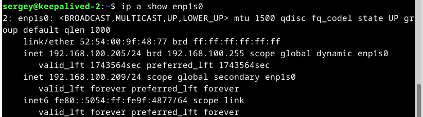

Возвращаем файл на место, адрес возвращается. Останавливаем Nginx адрес перемещается, стартуем - возвращается. 

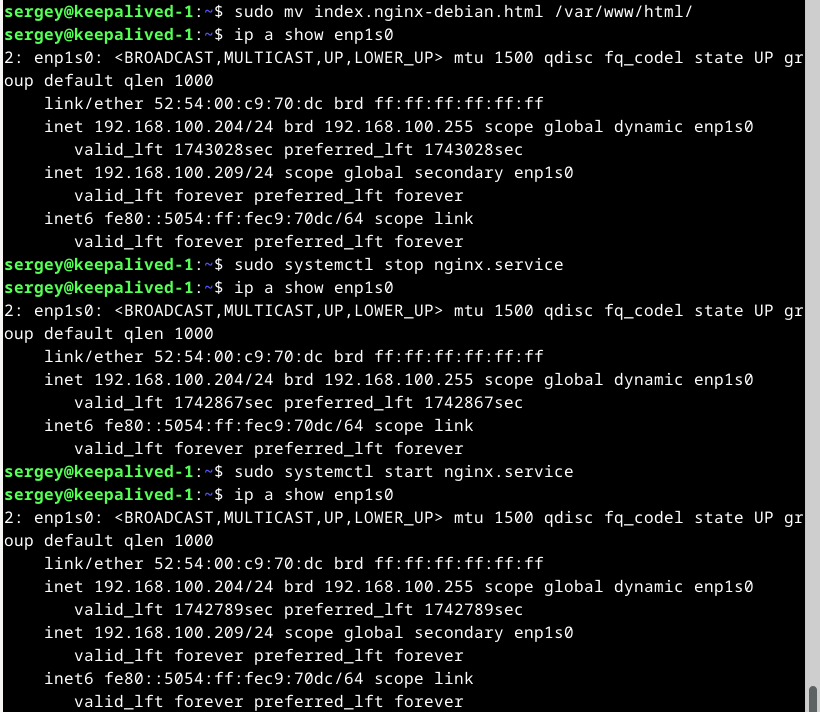

В это время он перемещается на (и с) keepalived-2

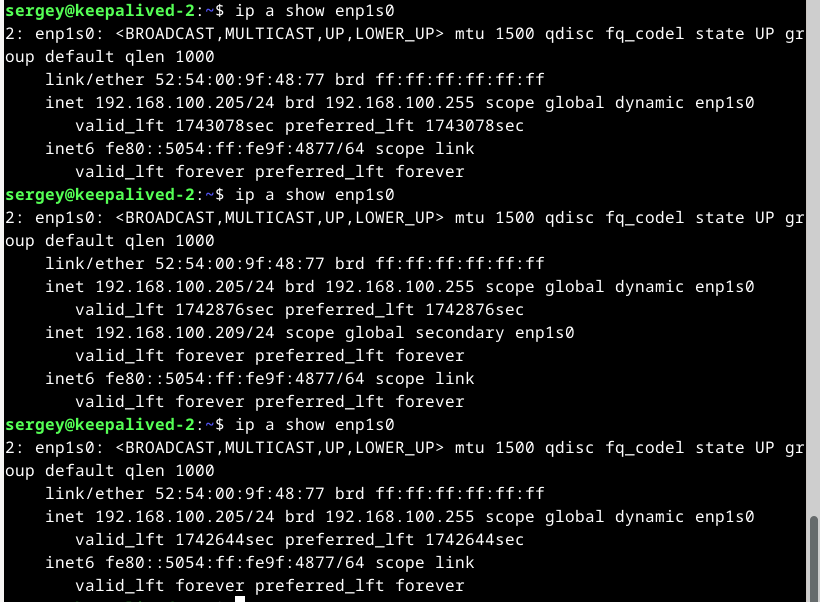

------

## Дополнительные задания со звёздочкой*

Эти задания дополнительные. Их можно не выполнять. На зачёт это не повлияет. Вы можете их выполнить, если хотите глубже разобраться в материале.
 
### Задание 3*
- Изучите дополнительно возможность Keepalived, которая называется vrrp_track_file
- Напишите bash-скрипт, который будет менять приоритет внутри файла в зависимости от нагрузки на виртуальную машину (можно разместить данный скрипт в cron и запускать каждую минуту). Рассчитывать приоритет можно, например, на основании Load average.
- Настройте Keepalived на отслеживание данного файла.
- Нагрузите одну из виртуальных машин, которая находится в состоянии MASTER и имеет активный виртуальный IP и проверьте, чтобы через некоторое время она перешла в состояние SLAVE из-за высокой нагрузки и виртуальный IP переехал на другой, менее нагруженный сервер.
- Попробуйте выполнить настройку keepalived на третьем сервере и скорректировать при необходимости формулу так, чтобы плавающий ip адрес всегда был прикреплен к серверу, имеющему наименьшую нагрузку.
- На проверку отправьте получившийся bash-скрипт и конфигурационный файл keepalived, а также скриншоты логов keepalived с серверов при разных нагрузках

### Решение

На всех трех нодах создал файл [/etc/keepalived/update_priority.sh](task-3/update_priority.sh) который записывает нагрузку (округленное произведение loadavg и 100) в файл current_load

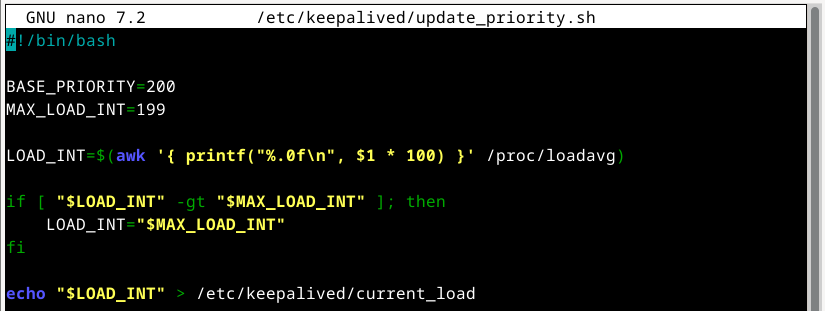

Прописал его в crontab для выполнения каждую минуту **(важно выполнить с sudo чтобы он выполнялся с правами root)**
```
sudo crontab -e
```
```
* * * * * /etc/keepalived/update_priority.sh
```

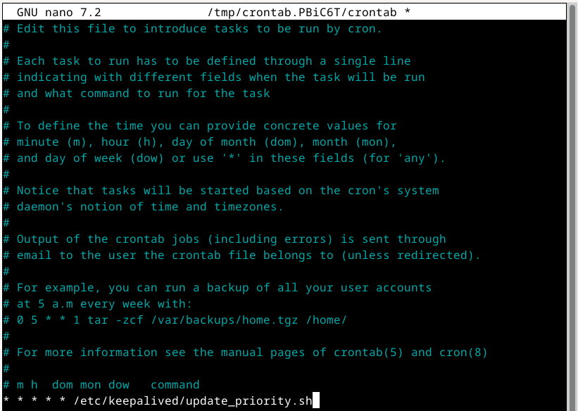

Создал конфигурационный файл Keepalived [/etc/keepalived/keepalived.conf](task-3/keepalived.conf)

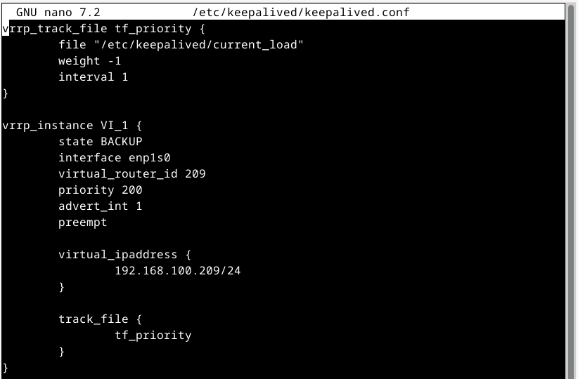

Логика работы такая: если присутствует параметр weight, то значение полученное из файла умножится на него и сложится с установленным для этой ноды priority. В моем случае нагрузка (0-199) отнимется (weight -1) от priority (200). В результате самая нагруженная нода будет иметь самый низкий приоритет.

Сначала VIP находится на первой ноде

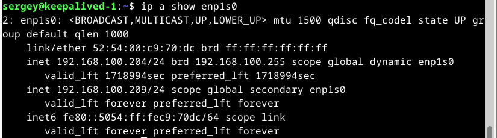

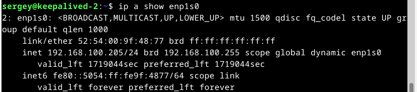

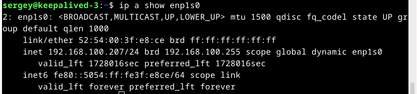

Запускаем stress на 4 минуты и видим, что через некоторое время его на первой ноде нет.

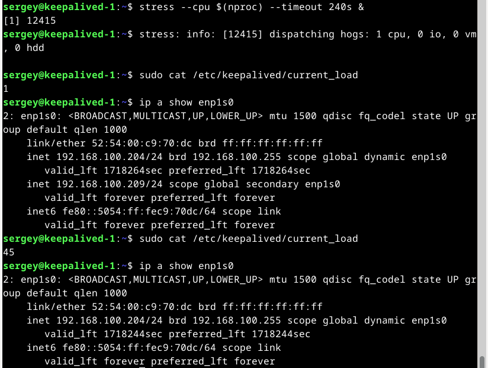

Находим его на второй ноде, здесь тоже запускаем stress на 4 минуты. Через некоторое время он перемещается.

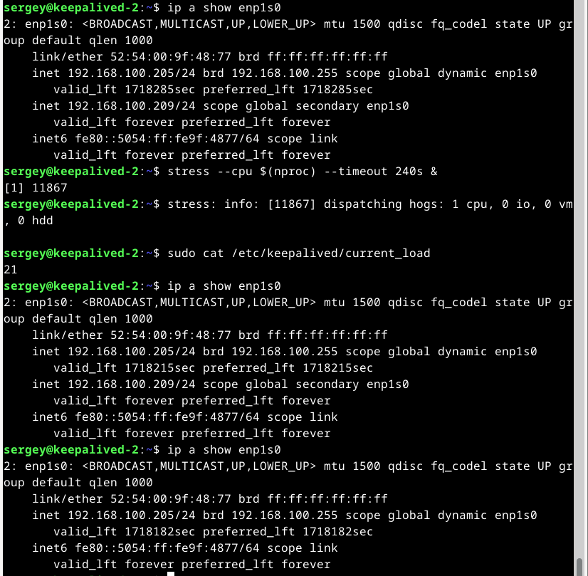

Теперь он уже на третьей ноде. И здесь запускаем stress на 4 минуты. Через время VIP перемещается.

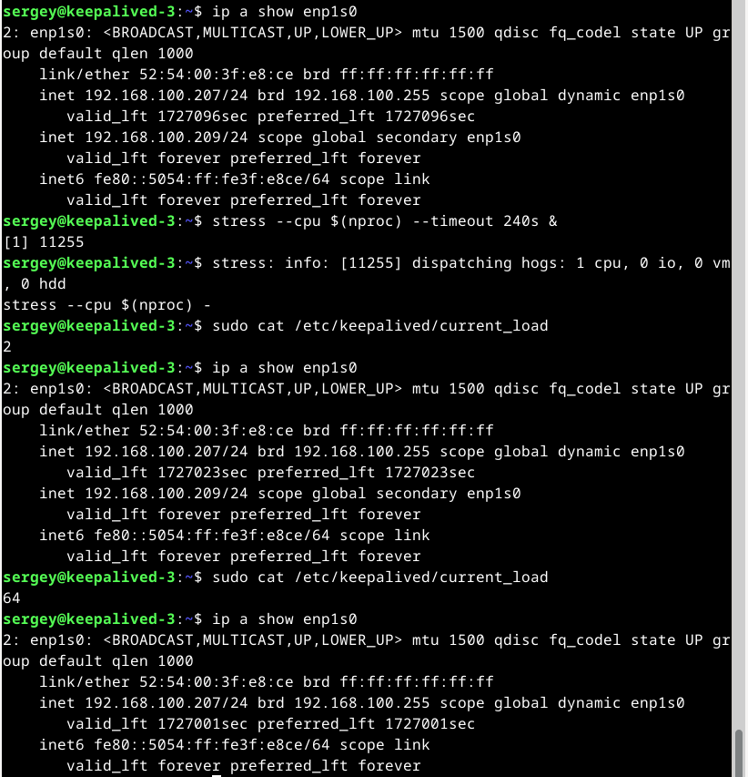

И VIP опять на первой ноде, где к этому времени stress закончил свою работу. 

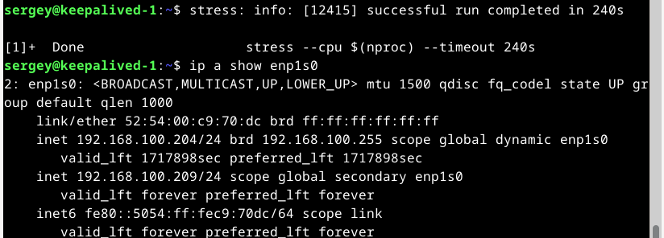

------

### Правила приема работы

1. Необходимо следовать инструкции по выполнению домашнего задания, используя для оформления репозиторий Github
2. В ответе необходимо прикладывать требуемые материалы - скриншоты, конфигурационные файлы, скрипты. Необходимые материалы для получения зачета указаны в каждом задании.

------

### Критерии оценки

- Зачет - выполнены все задания, ответы даны в развернутой форме, приложены требуемые скриншоты, конфигурационные файлы, скрипты. В выполненных заданиях нет противоречий и нарушения логики
- На доработку - задание выполнено частично или не выполнено, в логике выполнения заданий есть противоречия, существенные недостатки, приложены не все требуемые материалы.
